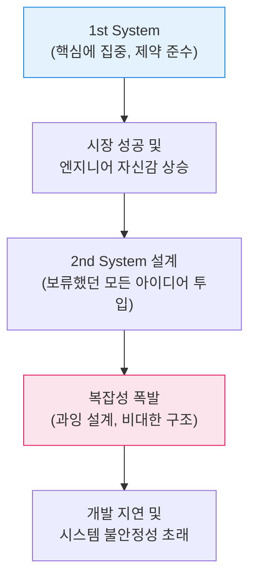

# 성공의 함정과 과도한 설계, Second-System 효과 (Second-System Effect)

## I. 성공 이후의 비대해진 욕심, Second-System 효과의 개요

**정의** : 작고 우아하며 성공적이었던 첫 번째 시스템을 뒤이어, 설계자의 과도한 의욕과 자신감으로 인해 기능이 과적되고 구조가 복잡해져 결국 실패하거나 비효율적이 되는 현상  

**핵심 특징 및 발생 원인** :  
( **프레드 브룩스의 통찰** ) 《맨머스 미신( **The Mythical Man-Month** )》에서 제안된 개념으로, 엔지니어가 첫 번째 시스템에서 절제했던 아이디어를 두 번째 시스템에 한꺼번에 쏟아부을 때 발생  
( **기능 과부하** ) "모든 것을 다 담겠다"는 욕심으로 인해 본질적인 목적은 흐려지고, 불필요한 기능( **Feature Creep** )이 기하급수적으로 증가  
( **설계의 경직성** ) 시스템이 비대해짐에 따라 유지보수가 어려워지고, 작은 변경에도 시스템 전체가 흔들리는 취약한 구조( **Fragility** ) 형성  
( **일정 지연 및 비용 상승** ) 복잡성 증가로 인해 예상보다 훨씬 많은 자원이 투입되지만, 실제 가동 효율은 첫 번째 시스템보다 떨어지는 역설 발생  

---

## II. Second-System 효과의 진행 매커니즘 및 주요 증상

### 가. 시스템 진화에 따른 복잡성 전이 모델

### 나. Second-System 증후군의 주요 증상 (Symptoms)

| 증상 구분 | 상세 내용 | 보안 및 관리적 영향 |
|:---:|----------|------------------|
| **장식적 기능 과다** | 본질적 기능보다 화려하거나 부차적인 기능에 자원 집중 | 공격 표면( **Attack Surface** )의 불필요한 확대 |
| **일반화의 오류** | 모든 상황에 대응하려는 범용성 설계로 인해 복잡성 증가 | 보안 설정 오류 및 취약점 식별 지연 |
| **의존성 복잡화** | 수많은 라이브러리와 외부 시스템과의 복잡한 연계 | 공급망 리스크( **Supply Chain Risk** ) 관리 난해 |
| **성능 저하** | 비대한 코드와 계층 구조로 인해 실제 구동 속도 저하 | 서비스 거부( **DoS** ) 공격에 대한 저항력 약화 |

---

## III. Second-System 효과 극복 방안 및 현대적 보안 가치

### 가. 1st System vs. 2nd System (Second-System 관점) 비교

| 비교 항목 | 1st System (성공적 모델) | 2nd System (실패 위험 모델) |
|:---:|-------------------------|---------------------------|
| **설계 철학** | 간결성( **KISS** ), 문제 해결 중심 | 일반화, 기능 집약, 완벽주의 |
| **자원 관리** | 한정된 자원의 효율적 배분 | 무한한 확장 및 과도한 자원 투입 |
| **의사결정** | 필수 기능 위주의 냉철한 판단 | 아이디어 중심의 감성적 추가 |
| **사용자 가치** | 즉각적인 가치 제공 ( **MVP** ) | 미래를 대비한(잠재적) 과잉 기능 |

### 나. 실무적 예방 전략: 지속 가능한 성장을 위한 제언
- **엄격한 자기 절제** : 새로운 기능을 추가할 때마다 그 가치를 정량적으로 평가하고, 본질을 해치지 않는지 끊임없이 자문할 것
- **점진적 진화 (Gall's Law 연계)** : 작동하는 단순한 시스템에서 조금씩 확장해 나가는 진화적 설계를 지향하고, '빅뱅' 방식의 전면 재개편을 경계할 것
- **사용자 중심의 검증** : 설계자의 욕심이 아닌 실제 사용자의 피드백을 기반으로 로드맵을 수립하여 불필요한 복잡성 제거
- **보안 내재화 (Security by Design)** : 기능을 늘리기보다, 기존 기능의 견고함과 보안성을 강화하는 내실 위주의 업데이트 권장

> **핵심** : **Second-System 효과**는 엔지니어의 숙련도가 높아질 때 오히려 가장 경계해야 할 심리적/기술적 함정이며, **단순함의 미학**을 유지하는 것이 진정한 기술적 성숙도임을 잊지 말아야 함
