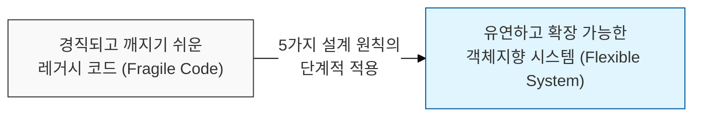
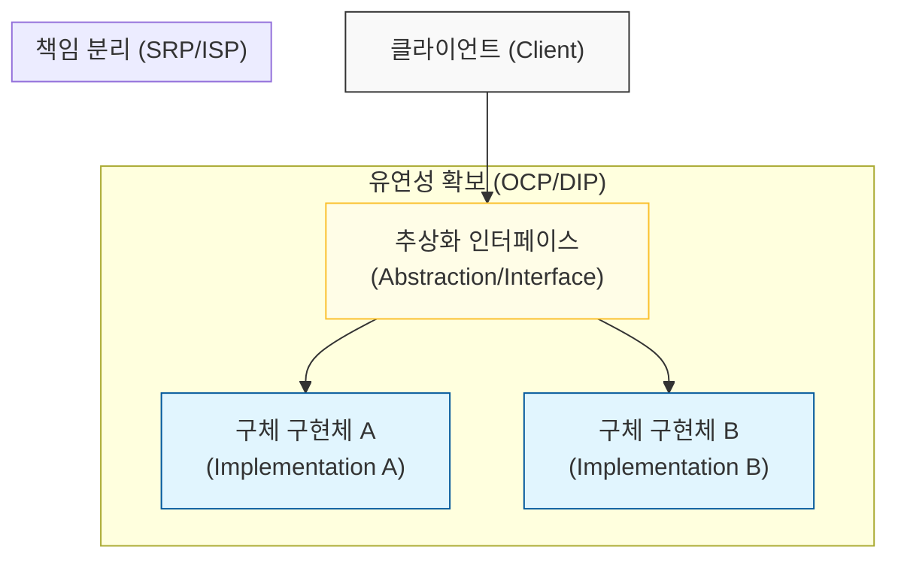

# 객체지향 설계의 5가지 핵심 이정표, SOLID 원칙

## I. 지속 가능한 객체지향 설계의 기반, **SOLID** 원칙 개요

**정의**: 소프트웨어를 더 이해하기 쉽고, 유연하며, 유지보수하기 쉽게 만들기 위해 로버트 마틴(**Robert C. Martin**)이 제안한 5가지 핵심 설계 원칙의 약어  

**특징**:  
( **높은 응집도** ) 각 객체가 명확한 한 가지 책임에 집중하여 내부 로직의 견고함을 확보함  
( **낮은 결합도** ) 객체 간의 의존성을 최소화하고 인터페이스에 의존하여 변경의 파급 효과를 차단함  
( **변경의 유연성** ) 새로운 요구사항 추가 시 기존 코드의 수정을 최소화하고 확장할 수 있는 구조를 제공함  

## II. **SOLID** 원칙의 세부 메커니즘과 형상화

### 가. 설계 품질 향상을 위한 의존성 관리 및 구조 모델

### 나. **SOLID** 5대 원칙 상세 분석
| **원칙** | **명칭 (Full Name)** | **핵심 메커니즘** | **주요 가치** |
| :---: | :--- | :--- | :--- |
| **S** | **SRP** (Single Responsibility) | 클래스는 단 하나의 변경 이유만 가져야 함 | 응집도 최적화 |
| **O** | **OCP** (Open-Closed) | 확장에는 열려 있고, 수정에는 닫혀 있어야 함 | 다형성 활용 |
| **L** | **LSP** (Liskov Substitution) | 하위 타입은 언제나 상위 타입으로 교체 가능해야 함 | 상속의 정당성 |
| **I** | **ISP** (Interface Segregation) | 클라이언트는 사용하지 않는 메서드에 의존 강제 금지 | 인터페이스 슬림화 |
| **D** | **DIP** (Dependency Inversion) | 고수준 모듈은 저수준 모듈의 구현에 의존하지 않음 | 의존성 방향 역전 |

## III. **SOLID** 원칙 적용 전략 및 실무적 고려사항

### 가. 안티패턴 대비 및 적용 전략 비교
| **비교 항목** | **SOLID** 적용 (Best Practice) | **STUPID** 상태 (Anti-Pattern) |
| :--- | :--- | :--- |
| **의존성** | 인터페이스 기반의 느슨한 결합 | 강한 결합 (**Tight Coupling**) |
| **확장성** | 코드 수정 없이 기능 추가 가능 | 변경 시마다 연쇄 버그 발생 (**Fragility**) |
| **테스트** | 모의 객체(**Mock**) 활용 용이 | 테스트 코드 작성이 불가능한 구조 |

### 나. 실무적 적용 제언
- **Avoid Over-Engineering**: **SOLID** 원칙을 기계적으로 모든 코드에 적용하면 오히려 복잡성이 증가할 수 있음(KISS 원칙과 충돌 주의). 변경 가능성이 높은 영역부터 점진적으로 적용해야 함
- **Balance with YAGNI**: 실제 확장이 필요한 시점에 **OCP**를 적용하는 것이 경제적임. 미리 추상화 레이어를 과도하게 만드는 것은 '조기 최적화'의 악순환을 초래할 수 있음
