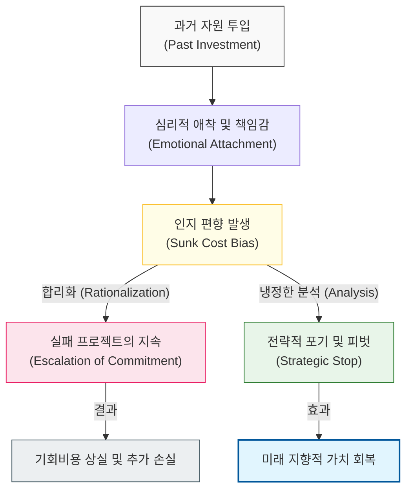

# 과거의 집착이 미래의 가치를 잠식한다, 매몰 비용 오류

## I. 비합리적 의사결정의 함정, 매몰 비용 오류 개요

**정의**: 이미 지불되어 회수할 수 없는 비용(시간, 노력, 자금)에 미련을 두어, 현재와 미래에 손실이 예상됨에도 불구하고 기존의 일을 지속하려는 비합리적인 성향  

**특징**:  
( **비합리적 집착** ) 의사결정 시 고려해야 할 '미래의 이득'보다 이미 투입된 '과거의 비용'에 더 큰 무게를 둠  
( **손실 회피 편향** ) 자신이 틀렸음을 인정하거나 이미 투입한 자원이 낭비되었음을 받아들이는 데 따르는 심리적 고통을 피하려 함  
( **자원 낭비 가속** ) 실패가 예견된 프로젝트에 인력과 예산을 추가로 투입하여 조직 전체의 위기를 초래함  

## II. 매몰 비용 오류의 작동 메커니즘과 형상화

### 가. 인지 부조화 및 의사결정 왜곡 모델

### 나. 소프트웨어 개발에서의 매몰 비용 오류 사례
| **상황 구분** | **매몰 비용의 형태** | **오류 현상 (Gaming)** |
| :--- | :--- | :--- |
| **레거시 유지** | 수년간 개발된 낡은 아키텍처 | 현대적 기술 전환보다 누더기식 유지보수 고수 |
| **실패한 프로젝트** | 수십 억 원의 기투입 개발비 | **Market-Fit** 실패가 명확해도 배포 강행 |
| **잘못된 도구 선택** | 수개월의 학습 및 설정 시간 | 생산성이 낮은 라이브러리를 끝까지 사용 |
| **오버엔지니어링** | 공들여 만든 복잡한 추상화 레이어 | 불필요한 기능임에도 삭제하지 못하고 방치 |

## III. 매몰 비용 오류 극복을 위한 조직적 전략

### 가. 합리적 의사결정 체계 구축 전략
| **전략** | **상세 내용** | **기대 효과** |
| :--- | :--- | :--- |
| **Zero-based Thinking** | 과거 투입을 무시하고 "오늘 다시 시작한다면?"을 자문 | 현재 가치 중심의 객관적 판단 가능 |
| **Kill Switch** | 프로젝트 중단을 결정할 명확한 정량적 기준 사전 설정 | 심리적 저항 없이 실패 프로젝트 정리 |
| **Opportunity Cost Focus** | 현재 자원을 다른 곳에 썼을 때의 이득을 상시 비교 | 자원 배분의 최적 효율성 확보 |

### 나. 프로젝트 관리 시 시사점
- **Admit Mistakes Early**: 잘못된 결정을 내렸음을 일찍 인정할수록 미래에 절약할 수 있는 자원이 많아짐을 인지해야 함
- **No-Blame Culture**: 실패를 인정하는 것을 패배가 아닌 '학습'으로 간주하는 문화가 형성되어야 매몰 비용의 늪에서 빠져나올 수 있음 (**Hanlon의 면도날**과 연계)
- **Concorde Fallacy**: '초음속 여객기 콩코드' 개발의 사례처럼 국가적/전사적 명분이 개입될수록 오류의 깊이가 깊어짐을 경계해야 함
