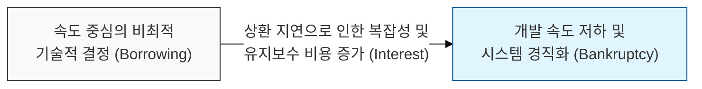
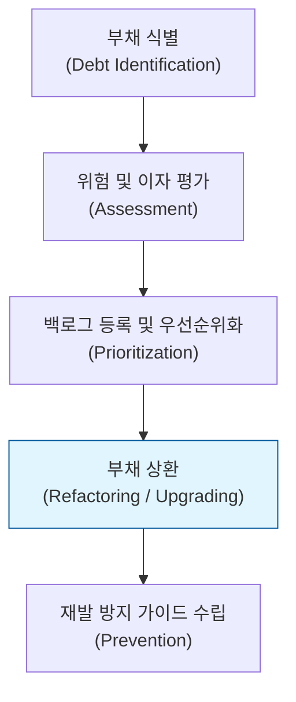

# 나중에 지불해야 할 이자, 기술 부채 (Technical Debt)

## I. 빠른 출시와 장기적 품질의 트레이드 오프, 기술 부채의 개요

**정의** : 빠른 시장 출시나 편의성을 위해 현재 시점에서 최적이 아닌 기술적 결정을 내림으로써, 향후 추가적인 리팩토링이나 수정 비용을 부담하게 되는 현상  

**핵심 특징 및 시사점** :  
( **부채의 이자** ) 부채를 상환(리팩토링)하지 않으면, 시간이 흐를수록 변경이 어려워지고 개발 속도가 급격히 떨어지는 '이자'가 발생함  
( **전략적 선택** ) 모든 부채가 나쁜 것은 아니며, 비즈니스 기회 확보를 위해 의도적으로 부채를 끌어쓰는 '전략적 부채'도 존재함  
( **보안 부채의 위험** ) 보안 검증을 생략하거나 레거시 프로토콜을 방치하는 것은 언제 터질지 모르는 고위험 '변동 금리 부채'와 같음  
( **기술 파산 (Technical Bankruptcy)** ) 이자가 원금을 초과하여 더 이상의 기능 추가나 수정이 불가능해진 상태로, 대규모 재구축 외엔 대안이 없음  

---

## II. 기술 부채의 사분면 및 관리 매커니즘

### 가. 기술 부채의 사분면 (Technical Debt Quadrant)

| 구분 | 의도적 (Deliberate) | 부주의/무지 (Inadvertent) |
|:---:|--------------------|------------------------|
| **무모함 (Reckless)** | "설계할 시간 없다, 일단 짜라" (가장 위험) | "레이어드 아키텍처가 뭐죠?" (교육 부족) |
| **신중함 (Prudent)** | "출시를 위해 지금은 이렇게 하고 나중에 고치자" | "다 만들고 나니 더 좋은 방법이 있었네" (경험적 학습) |

### 나. 기술 부채의 관리 라이프사이클

---

## III. 기술 부채와 보안 거버넌스의 연계 전략

### 가. 주요 '보안 부채' 유형 및 조치 방안

| 부채 유형 | 구체적 사례 | 보안적 리스크 | 대응 전략 |
|:---:|------------|--------------|----------|
| **버전 부채** | 지원 종료된 OS/라이브러리 방치 | 알려진 취약점( **CVE** ) 노출 | 정기적인 종속성 업데이트( **SCA** ) |
| **설계 부채** | 하드코딩된 암호, 평문 통신 | 자격증명 유출 및 도청 위험 | **Security by Design**, 비밀번호 관리자 도입 |
| **프로세스 부채** | 보안 코드 리뷰, 취약점 진단 생략 | 논리적 결함 및 백도어 잔존 | **DevSecOps** 파이프라인 내재화 |
| **데이터 부채** | 불필요한 개인정보의 무기한 보관 | 데이터 유출 시 피해 규모 확대 | 데이터 파기 정책 및 가명화 적용 |

### 나. 실무적 부채 상환 전략
- **기술 부채 가시화** : 소스 코드 분석 도구( **SonarQube** 등)를 통해 '기술 부채 수일(Days)'을 측정하고 지표화
- **정기적 부채 상환일 운영** : 전체 스프린트의 10~20%를 기능 개발이 아닌 부채 상환(리팩토링)에 할당
- **보안 부채 우선순위** : 비즈니스 로직 부채보다 외부 노출이 있는 보안 부채를 최우선으로 상환하는 정책 수립

> **핵심** : **기술 부채**는 피할 수 없는 현실이지만, 이를 **가시화**하고 **계획적으로 상환**하는 능력이 조직의 장기적인 보안 성숙도와 경쟁력을 결정함
