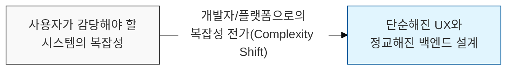
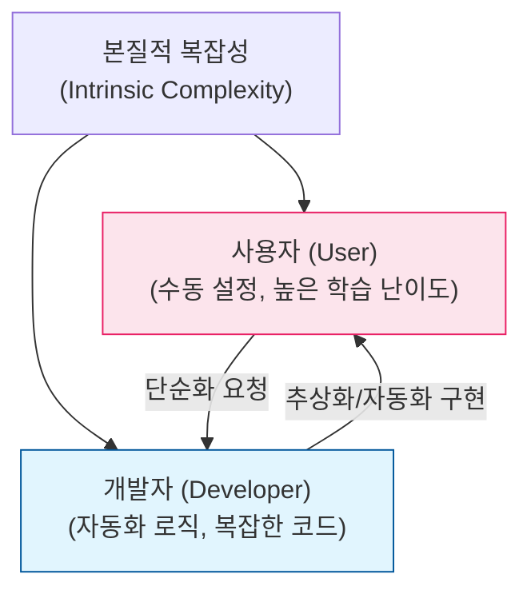

# 제거할 수 없는 복잡성의 총량, 테슬러의 법칙 (Tesler's Law)

## I. 복잡성 보존의 원칙과 사용자 경험의 접점, 테슬러의 법칙 개요

**정의** : "모든 시스템에는 더 이상 줄일 수 없는 일정량의 복잡성이 존재하며, 그 복잡성을 누가 부담할 것인가(사용자 또는 개발자)의 문제만 남는다"는 원칙으로, **복잡성 보존 법칙**(The Law of Conservation of Complexity)이라고도 함  

**핵심 특징 및 시사점** :  
( **복잡성 보존** ) 시스템의 본질적인 복잡성은 사라지지 않으며, 단지 한 곳에서 다른 곳으로 이동할 뿐임  
( **UX 디자인의 핵심** ) 사용자의 사용성을 높이기 위해(단순화) 개발자가 백엔드에서 더 많은 복잡한 로직을 처리해야 함을 시사함  
( **트레이드 오프** ) 지나친 단순화는 개발 및 유지보수 비용을 급격히 증가시키고, 시스템의 유연성을 떨어뜨릴 수 있음  
( **인지적 부하 관리** ) 래리 테슬러( **Larry Tesler** )가 제안했으며, 현대적 인터페이스 설계와 보안 설정 자동화의 근거로 활용됨  

---

## II. 테슬러의 법칙 작동 메커니즘과 복잡성 전이 모델

### 가. 복잡성의 주체별 전이 구조

### 나. 복잡성 관리 전략 및 접근 방식

| 전략 항목 | 상세 내용 | 영향도 및 가치 |
|:---:|----------|--------------|
| **추상화 (Abstraction)** | 복잡한 하위 로직을 단순한 인터페이스로 캡슐화 | 사용자의 인지 부하 감소 |
| **기본값 설정 (Defaulting)** | 복잡한 옵션을 최적의 기본값으로 미리 설정 | 사용자 의사결정 단계 간소화 |
| **자동화 (Automation)** | 반복적이고 복잡한 수동 작업을 시스템이 처리 | 휴먼 에러( **Human Error** ) 방지 |
| **단계적 노출 (Disclosure)** | 필요한 시점에만 복잡한 기능을 사용자에게 노출 | 인터페이스의 간결성 유지 |

---

## III. 테슬러의 법칙과 보안 설계의 연계

### 가. 보안성과 사용성(Usability)의 복잡성 트레이드 오프

| 보안 기능 | 사용자가 부담할 때 (High User Burden) | 개발자/시스템이 부담할 때 (High Dev Burden) |
|:---:|-----------------------------------|---------------------------------------|
| **암호화** | 사용자가 수동으로 키를 관리하고 암호화 | 시스템이 자동으로 종단 간 암호화( **E2EE** ) 수행 |
| **인증** | 매번 복잡한 비밀번호와 **MFA** 입력 | 생체 인증( **Passkey** ), **SSO** 자동 로그인 |
| **설정** | 보안 방화벽 정책을 사용자가 직접 구성 | 관리형 서비스( **Managed Service** )가 자동 최적화 |

### 나. 실무적 적용 제언: 균형 잡힌 보안 설계
- **보안의 투명성(Transparency)** : 복잡한 보안 로직을 시스템 내부에 내재화하여 사용자가 보안 활동을 의식하지 않고도 안전하게 서비스를 이용하도록 설계
- **적정 복잡성 유지** : 개발자가 모든 복잡성을 떠안을 경우 코드의 난해함으로 인해 '누수 추상화'나 새로운 보안 결함이 발생할 수 있으므로, 적절한 추상화 경계 설정 필수
- **사용자 권한의 존중** : 단순화를 위해 사용자의 선택권을 완전히 박탈하기보다, 전문가 모드 등을 통해 복잡성을 다룰 수 있는 경로를 별도로 제공

> **핵심** : **테슬러의 법칙**은 우리에게 "세상에 공짜 단순함은 없다"는 진리를 알려주며, 진정으로 가치 있는 시스템은 **개발자의 헌신적인 설계**를 통해 사용자의 고통을 대신 짊어지는 시스템임
