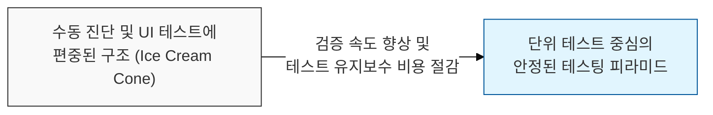
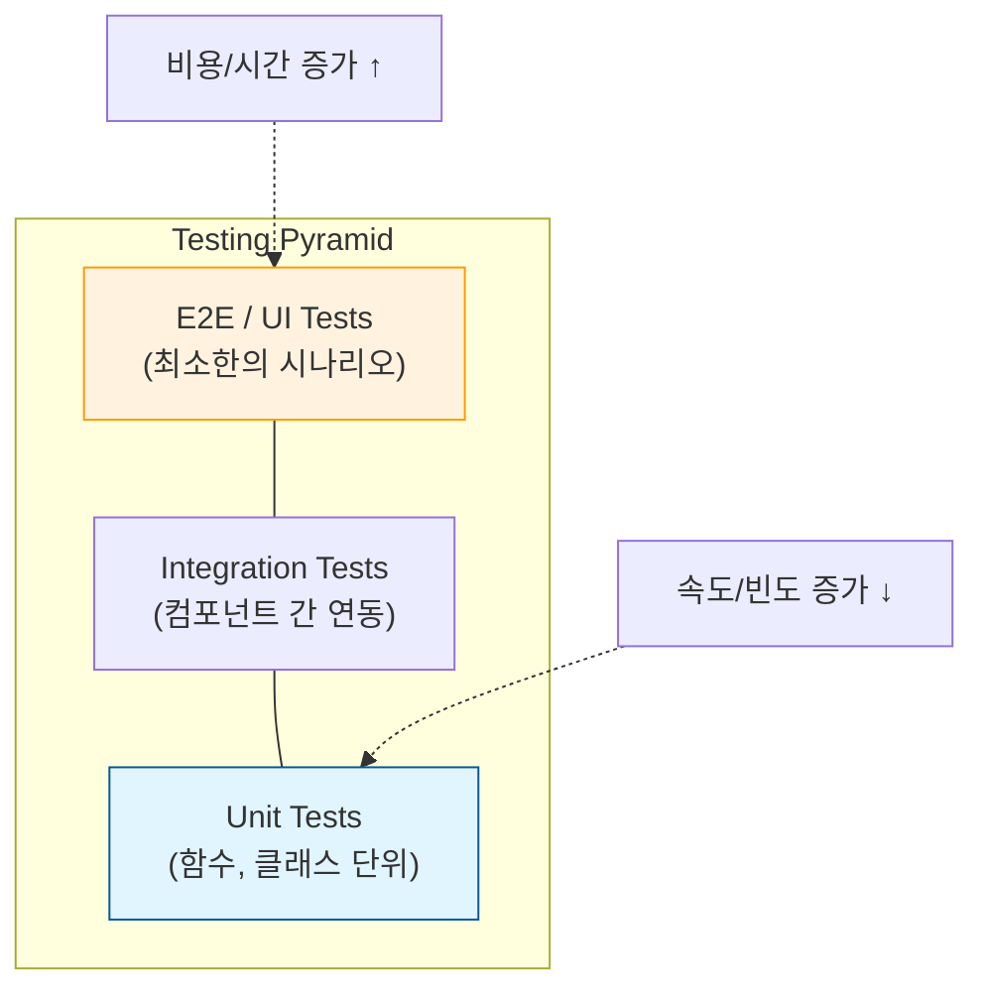

# 효율적 검증의 아키텍처, 테스팅 피라미드 (Testing Pyramid)

## I. 테스트 자동화의 속도와 비용 최적화, 테스팅 피라미드의 개요

**정의** : 소프트웨어 테스트의 종류를 계층화하여, 하단부(단위 테스트)는 많이 작성하고 상단부(UI/E2E 테스트)는 적게 작성함으로써 테스트의 효율성을 극대화하는 전략적 모델  

**핵심 특징 및 가치** :  
( **비용 및 속도 최적화** ) 하위 계층 테스트는 실행 속도가 빠르고 비용이 저렴하며, 상위로 갈수록 실행 속도가 느려지고 구축 비용이 상승함  
( **피드백 루프 단축** ) 단위 테스트 중심의 구조는 코드 변경 즉시 결함을 발견할 수 있게 하여 개발 생산성( **Productivity** )을 높임  
( **테스트 안정성 확보** ) 상위 계층 테스트의 취약성( **Flakiness** ) 문제를 최소화하고, 하위 계층의 견고한 검증을 통해 시스템 신뢰성 구축  
( **마이크 코헨의 제안** ) 마이크 코헨( **Mike Cohn** )이 주창했으며, 현대 **DevSecOps** 파이프라인 내 테스트 자동화의 표준 지침으로 활용됨  

---

## II. 테스팅 피라미드의 계층 구조 및 상세 특징

### 가. 테스트 계층별 구성 모델

### 나. 계층별 핵심 활동 및 보안 연계

| 테스트 계층 | 검증 범위 및 목적 | 보안 테스트 연계 전략 |
|:---:|------------------|-------------------|
| **E2E / UI** | 사용자 관점의 전체 비즈니스 흐름 검증 | **DAST**, 실제 공격 시나리오 기반 침투 테스트 |
| **Integration** | 모듈 간 상호작용 및 데이터 흐름 검증 | **IAST**, **API** 취약점 및 인증/인가 연동 검사 |
| **Unit** | 개별 함수, 로직의 독립적 무결성 검증 | **SAST**, 시큐어 코딩 규칙 준수 및 입력값 검증 |

---

## III. 안티패턴 극복과 현대적 확장 모델

### 가. 아이스크림 콘(안티패턴) vs. 테스팅 피라미드

| 비교 항목 | 아이스크림 콘 (Anti-pattern) | 테스팅 피라미드 (Best Practice) |
|:---:|---------------------------|------------------------------|
| **테스트 비중** | **UI/수동 테스트**에 과도하게 집중 | **단위 테스트**가 전체의 70~80% 차지 |
| **발견 시점** | 개발 후반부나 배포 직전 발견 | 개발 초기 단계( **Shift-Left** )에서 발견 |
| **유지보수** | 작은 UI 변경에도 테스트가 빈번히 깨짐 | 로직 중심 검증으로 테스트 환경이 안정적임 |
| **결과** | 느린 릴리즈, 높은 버그 수정 비용 | 지속적 배포( **CD** ) 및 고품질 유지 가능 |

### 나. 실무적 고도화 전략: 테스팅 트로피(Testing Trophy)로의 진화
- **통합 테스트 강화** : 최근 **MSA** 환경에서는 단위 테스트보다 서비스 간 연동을 검증하는 통합 테스트의 비중을 높이는 '트로피 모델'이 대두됨
- **보안 자동화 통합** : 모든 테스트 계층에 보안 스캔을 자동화하여 취약점이 상위 계층으로 전이되지 않도록 파이프라인 설계
- **계약 테스트 (Contract Testing)** : 마이크로서비스 간의 **API** 규격을 강제하는 테스트를 통해 분산 환경에서의 정합성 보장

> **핵심** : **테스팅 피라미드**는 단순한 비율의 문제를 넘어, **비용 대비 효율**이 가장 높은 지점에서 결함을 차단하여 **안전하고 빠른 소프트웨어 인도**를 가능케 하는 전략적 자산임
