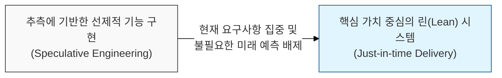
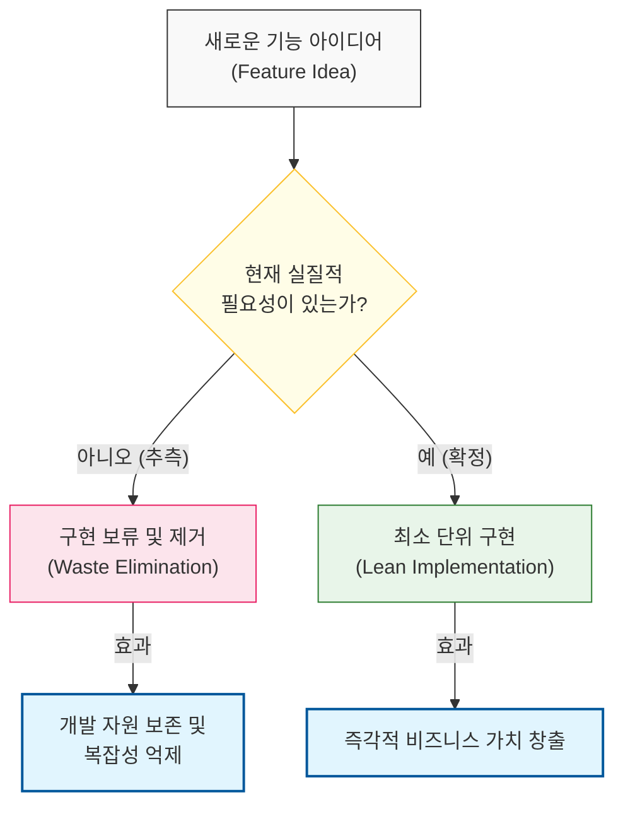

# 정말 필요할 때까지는 만들지 마라, YAGNI 원칙

## I. 추측 기반 개발의 배제, **YAGNI** 원칙 개요

**정의**: "정말 필요할 때까지는 기능을 추가하지 마라"(You Aren't Gonna Need It)의 약자로, 미래에 필요할 것이라는 추측만으로 코드를 작성하지 말라는 익스트림 프로그래밍(**XP**)의 핵심 원칙  

**특징**:  
( **기회비용 절감** ) 쓰이지 않을 수도 있는 기능을 구현하는 데 드는 시간과 노력을 현재의 핵심 가치 창출에 집중함  
( **설계 단순화** ) 시스템의 규모와 복잡성을 최소로 유지하여 가독성을 높이고 기술 부채의 발생을 원천 차단함  
( **변경 유연성** ) 추측으로 만든 복잡한 추상화 레이어가 미래의 실제 요구사항 변경을 방해하는 '설계의 경직성'을 방지함  

## II. **YAGNI** 원칙의 메커니즘과 형상화

### 가. 요구사항 발생 시점에 따른 가치-비용 최적화 모델

### 나. 선제적 구현 vs 적기 구현(Just-in-time) 비교
| **비교 항목** | **선제적 구현 (Just-in-case)** | **적기 구현 (YAGNI/JIT)** |
| :--- | :--- | :--- |
| **자원 활용** | 미래를 대비한 자원 선투입 (낭비 가능성) | 현재 필요한 곳에 자원 집중 투입 |
| **코드 상태** | 복잡한 추상화 및 사용되지 않는 코드 존재 | 명확하고 단순한 핵심 로직 유지 |
| **리스크** | 잘못된 예측으로 인한 전면 재작성 위험 | 실제 요구사항 확인 후 구현으로 리스크 최소화 |
| **철학** | "나중에 필요할 거야" | "정말 필요할 때 만든다" |

## III. **YAGNI** 원칙 적용 전략 및 실무적 고려사항

### 가. **YAGNI** 실천을 위한 설계 전략
| **전략** | **상세 내용** | **연관 원칙** |
| :--- | :--- | :--- |
| **MVP Focus** | 최소 기능 제품 단위로 쪼개어 가치 검증 | **Lean Startup** |
| **Refactoring** | 나중에 필요해질 때 설계를 유연하게 변경 | **Clean Code** |
| **Continuous Feedback** | 사용자 피드백을 통해 실제 필요성 수시 확인 | **Agile** |

### 나. 개발 시 시사점
- **Evolutionary Design**: 아키텍처는 한 번에 완성되는 것이 아니라, 실제 요구사항의 변화에 따라 진화해야 함. 초기 단계에서의 과도한 범용성 설계는 독이 될 수 있음
- **Balance with Extensibility**: **YAGNI**가 '확장 불가능한 코드'를 의미하는 것은 아님. 확장이 용이하도록 인터페이스를 열어두되, 구현체는 현재 필요한 것만 작성하는 균형이 필요함
