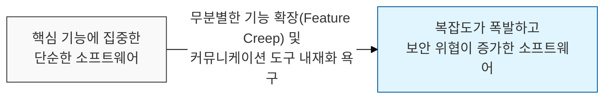
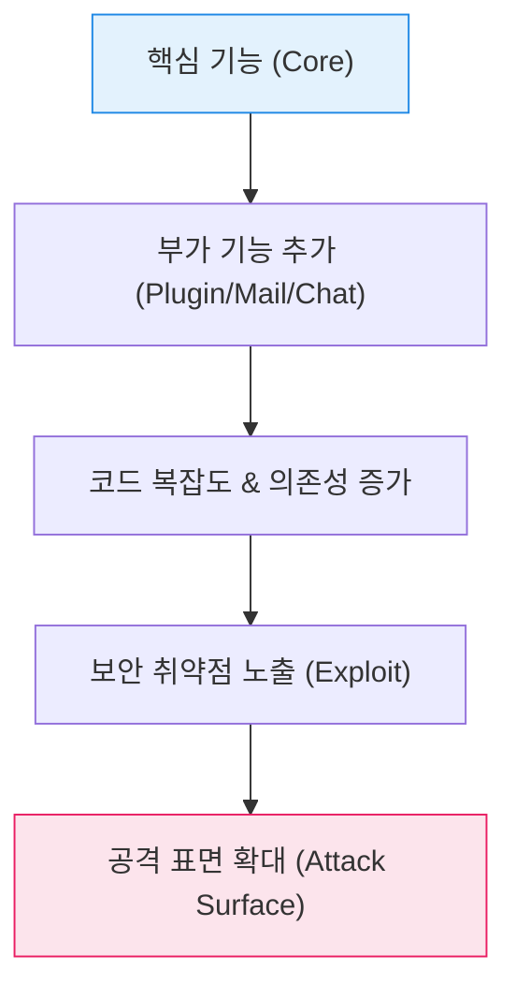

# 소프트웨어 팽창과 보안 위협의 상관관계, 자윈스키의 법칙 (Zawinski's Law)

## I. 모든 소프트웨어는 비대해진다는 숙명, 자윈스키의 법칙 개요

**정의** : "모든 프로그램은 이메일을 읽을 수 있는 수준까지 확장되려는 경향이 있으며, 그렇게 확장되지 않는 프로그램은 결국 이메일 읽기가 가능한 프로그램에 의해 대체된다"는 법칙  

**핵심 특징 및 시사점** :  
( **소프트웨어 팽창(Bloatware)** ) 초기 성공 이후 사용자의 요구와 시장 경쟁을 위해 본질과 무관한 기능을 무한히 추가하게 됨  
( **커뮤니케이션 내재화** ) 협업이 중요해짐에 따라 거의 모든 현대적 소프트웨어가 메일, 채팅, 알림 등 통신 기능을 포함하게 됨을 상징  
( **공격 표면(Attack Surface)의 확대** ) 불필요한 기능이 늘어날수록 코드 복잡도가 증가하고, 이는 필연적으로 보안 취약점의 증가로 이어짐  
( **제이미 자윈스키(JWZ)의 통찰** ) 넷스케이프( **Netscape** ) 개발자였던 제이미 자윈스키가 제안했으며, 소프트웨어 아키텍처의 단순성 유지의 어려움을 풍자함  

---

## II. 자윈스키의 법칙이 초래하는 보안 위협 매커니즘

### 가. 기능 확장과 보안 위험의 상관관계 모델

### 나. 소프트웨어 비대화에 따른 구체적 위협 사례

| 위협 유형 | 상세 내용 | 보안적 영향 |
|:---:|----------|----------|
| **불필요한 권한 요구** | 이메일/연락처 접근 기능을 위해 과도한 시스템 권한 획득 | 개인정보 유출 및 권한 상승 취약점 |
| **공급망 리스크 (SCA)** | 외부 기능을 끌어오기 위해 수많은 서드파티 라이브러리 도입 | 취약한 오픈소스에 의한 간접 침투 경로 노출 |
| **데이터 노출** | 채팅/메일 기능을 통해 민감 데이터가 의도치 않게 공유됨 | 데이터 유출( **DLP** ) 통제 난해 |
| **코드 가독성 저하** | 스파게티 코드로 변모하며 보안 로직 검증이 불가능해짐 | **백도어**나 악성 로직 삽입 탐지 불가 |

---

## III. 자윈스키의 법칙 극복을 위한 보안 및 설계 전략

### 가. 단순성 유지 전략: UNIX 철학 vs. 자윈스키의 법칙

| 비교 항목 | UNIX 철학 (Do one thing well) | 자윈스키의 법칙 (Feature Creep) |
|:---:|-----------------------------|-------------------------------|
| **설계 지향** | 단일 목적, 최소 기능 | 다목적, 통합 플랫폼 |
| **상호 작용** | 파이프( **Pipe** )를 통한 외부 연동 | 내부 모듈로 모든 기능 통합 |
| **보안 강점** | 작은 코드 베이스, 검증 용이성 | 통합된 사용자 경험 제공 |
| **보안 약점** | 연동 과정의 보안 설정 복잡 | 방대한 공격 표면, 관리 복잡성 |

### 나. 실무적 예방 및 관리 방안
- **모듈화 및 플러그인 구조** : 핵심 엔진과 부가 기능을 철저히 분리하여 부가 기능의 취약점이 핵심 시스템으로 전이되지 않도록 격리( **Sandboxing** )
- **공격 표면 관리 (ASM)** : 정기적으로 사용되지 않는 기능을 식별하여 제거( **Unused Feature Removal** )하고 최소 기능 원칙 고수
- **SBOM (Software Bill of Materials) 도입** : 비대해진 소프트웨어의 모든 구성 요소와 라이브러리를 가시화하여 취약점 발생 시 신속히 대응
- **사용자 중심의 가치 평가** : "이메일 읽기"와 같은 부가 기능이 실제 서비스 가치에 필수적인지 냉정하게 평가하고 대안(외부 연동 등) 모색

> **핵심** : **자윈스키의 법칙**은 소프트웨어의 자연스러운 노화 과정을 설명하며, 이를 거스르기 위한 **단순함에 대한 집착**과 **지속적인 다이어트**가 강력한 보안의 근간임
