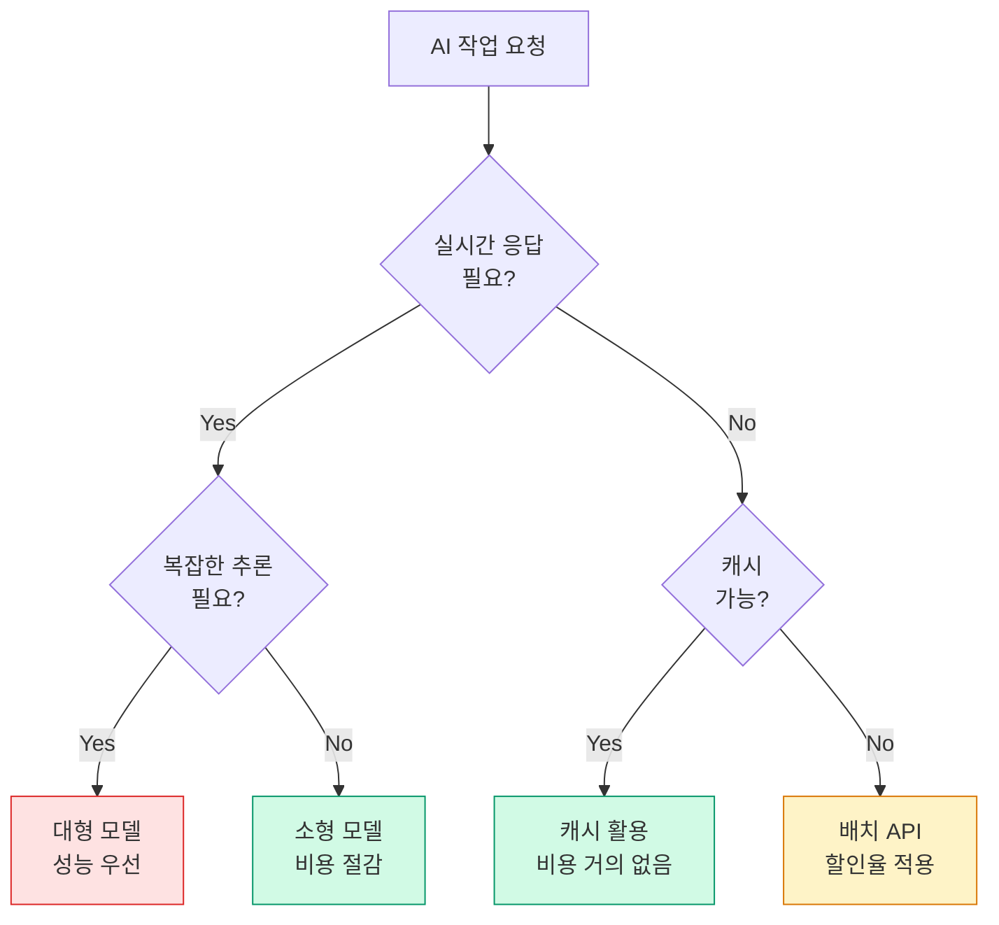

# AI 시스템의 비용 효율성과 FinOps

## AI 비용의 특수성

LLM API 호출 비용과 GPU 자원 소모는 기업에 큰 부담입니다. 전통 소프트웨어와 다르게 **사용량 기반 비용 구조**를 가집니다.

**비용 구성:**
- 입력 토큰 수 × 단가
- 출력 토큰 수 × 단가 (일반적으로 더 비쌈)
- 임베딩 API 호출 수
- 벡터 DB 저장 및 조회

## 비용 최적화 전략

### 1. 프롬프트 최적화

같은 결과를 내면서 토큰 소비를 줄입니다.

```
Before (500 토큰):
"당신은 매우 도움이 되고 친절한 소프트웨어 엔지니어링 전문가입니다.
 사용자의 질문에 자세하고 친절하게 답변해주세요..."

After (100 토큰):
"SW 엔지니어링 전문가. 간결하고 정확하게 답변."
```

### 2. 캐싱 전략

반복되는 LLM 호출 결과를 캐시합니다.

```python
# 프롬프트 캐싱 예시
@lru_cache(maxsize=1000)
def get_cached_response(prompt_hash: str) -> str:
    return llm.complete(prompt)

# 시맨틱 캐싱 (의미적으로 비슷한 쿼리 캐싱)
def semantic_cache_lookup(query: str) -> Optional[str]:
    embedding = embed(query)
    similar = vector_db.search(embedding, threshold=0.95)
    return similar[0].response if similar else None
```

### 3. 모델 선택 최적화

모든 작업에 가장 강력한 모델이 필요하지 않습니다.

| 작업 유형 | 적합한 모델 |
|---------|-----------|
| 간단한 분류, 요약 | 소형 모델 (비용 절감) |
| 복잡한 추론, 코드 생성 | 대형 모델 |
| 임베딩 생성 | 전문 임베딩 모델 |
| 실시간 응답 필요 | 빠른 모델 우선 |



### 4. 배치 처리

실시간 응답이 필요 없는 작업은 배치로 처리합니다.

```
실시간 필요:     사용자 채팅, 코드 자동완성
배치 가능:       문서 분석, 데이터 변환, 리포트 생성
```

## FinOps: AI 비용 관리 체계

### 비용 모니터링

```yaml
# 비용 알림 설정 예시
alerts:
  - name: 일일 비용 초과
    threshold: 100  # USD
    window: 1d
    action: slack_notify

  - name: 토큰 사용량 급증
    threshold: 200%  # 전일 대비
    window: 1h
    action: page_on_call
```

### 비용 할당 (Cost Attribution)

어떤 기능/팀/서비스가 얼마나 사용하는지 추적합니다.

```python
# 비용 태깅 예시
response = llm.complete(
    prompt=prompt,
    metadata={
        "team": "backend",
        "feature": "code-review",
        "user_tier": "premium"
    }
)
```

### 예산 계획

- 기능별 토큰 예산 설정
- 월별 비용 상한 설정 및 자동 알림
- 비용 대비 가치 정기 검토 (비용 효율이 낮은 기능 개선)

## 핵심 메시지

AI 비용 최적화는 **알고리즘 및 성능 공학의 영역**입니다. 효율적인 프롬프트 설계, 캐싱 전략, 모델 선택은 전통적인 성능 최적화 사고방식을 AI에 적용한 것입니다.

클라우드 비용을 예측하고 관리하는 공학적 체계(FinOps)가 AI 프로젝트의 성패를 가르기도 합니다.
