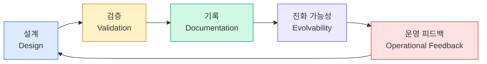

# AI시대에 재조명받는 5가지 핵심

AI 시대에 재조명되는 소프트웨어 공학은 단순히 "엄격한 프로세스"가 아닙니다. 실제로는 다음 다섯 가지입니다.

## 1. 설계 (Design)

시스템 경계, 데이터 흐름, 품질속성 우선순위를 결정하는 능력.

AI가 코드를 빠르게 생성할수록, 그 코드들이 **어디서 시작하고 어디서 끝나야 하는지** 정의하는 설계가 더 중요해집니다. Clean Architecture, MSA, 도메인 모델 등의 설계 기술은 AI 시대에도 인간 엔지니어의 핵심 역량입니다.

## 2. 검증 (Validation)

테스트, 리뷰, 정적 분석, 관측 가능성.

AI 생성 코드는 그럴듯해 보이지만 항상 옳지 않습니다. 유닛 테스트, 통합 테스트, 코드 리뷰, 정적 분석 도구를 통해 AI 결과물을 **결정론적으로 검증**하는 체계가 필요합니다.

## 3. 기록 (Documentation)

왜 그렇게 만들었는지 남기는 의사결정 기록.

ADR(Architecture Decision Record), 설계 문서, 코드 주석은 단순 참고자료가 아닙니다. 이제는 **AI의 품질을 좌우하는 실행 컨텍스트**입니다. 잘 작성된 문서는 AI가 올바른 방향으로 코드를 생성하게 돕는 가이드가 됩니다.

## 4. 진화 가능성 (Evolvability)

리팩터링 가능 구조, 모듈성, 낮은 결합.

AI가 대량의 코드를 생성할수록 **변경이 쉬운 구조**가 더 중요해집니다. 높은 응집도, 낮은 결합도, DRY 원칙을 따르는 코드는 AI에게도 다루기 쉽고, 사람에게도 유지보수하기 쉽습니다.

## 5. 운영 피드백 (Operational Feedback)

장애, 성능, 보안 이슈를 다시 설계로 연결하는 루프.

소프트웨어는 배포 후에도 살아있습니다. 운영에서 발생하는 장애 패턴, 성능 병목, 보안 취약점을 **다시 설계와 코드 개선으로 연결**하는 피드백 루프가 AI 시대에도 핵심입니다.

---

## 요약

AI시대의 소프트웨어 공학은 코딩을 느리게 만드는 관리 기법이 아닙니다.

**AI가 만든 속도를 시스템 품질로 바꾸는 변환 장치**입니다.

| 공학 요소 | AI 시대의 역할 |
|-----------|---------------|
| 설계 | AI 코드가 통합될 경계와 구조 정의 |
| 검증 | AI 생성 결과의 결정론적 신뢰 확보 |
| 기록 | AI의 컨텍스트이자 실행 가이드 |
| 진화 가능성 | AI가 다루기 쉬운 모듈 구조 유지 |
| 운영 피드백 | 현실 데이터를 설계 개선으로 연결 |

