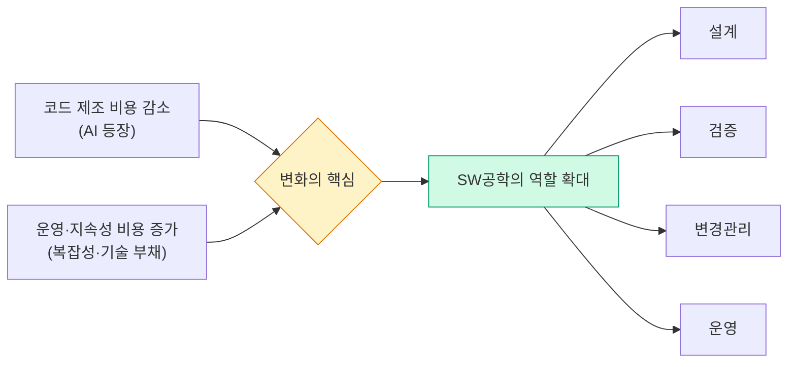

# AI시대의 SW공학

> AI는 코드를 더 많이 만들게 했고, 그래서 설계·검증·변경관리·운영을 다루는 소프트웨어 공학이 더 중요해졌습니다.

## 핵심 명제

AI 시대에 소프트웨어 공학이 다시 주목받는 이유는 간단합니다.

코드를 **"만드는 비용"** 은 급격히 내려갔지만, 소프트웨어를 **"지속 가능하게 운영하는 비용"** 은 오히려 더 중요해졌기 때문입니다.

AI는 코드를 빠르게 만들어주지만, 그 코드가 시스템 전체에서 어떤 영향을 내는지, 장기적으로 유지보수 가능한지, 품질 속성과 운영 리스크를 만족하는지는 여전히 **소프트웨어 공학의 영역**입니다.

## 두 가지 관점

이 사이트는 두 가지 관점에서 AI시대의 SW공학을 다룹니다.

### 관점 1: 실무 엔지니어링 (현장 중심)

DORA, Thoughtworks, Martin Fowler의 연구를 바탕으로 **팀이 당장 적용할 수 있는** 공학적 실천들을 다룹니다.

- AI가 공학 조직의 강점과 약점을 증폭하는 방식
- 아키텍처·품질·문서·테스트 체계의 구체적 실천
- 개발자 역할이 "작성자"에서 "설계자·검증자·운영자"로 이동하는 흐름

### 관점 2: 시스템 공학 (기술 심화)

AI 기반 소프트웨어의 운영 현실에서 나타나는 새로운 공학 영역들:

- LLMOps와 MLOps 파이프라인
- AI 시스템의 보안·윤리적 가드레일
- 비용 효율성과 자원 최적화

## 이 사이트의 구성

| 섹션 | 핵심 질문 |
|------|-----------|
| **AI × 공학** | AI는 공학을 대체하는가, 증폭하는가? |
| **시스템 설계** | 개별 코드 → 전체 시스템으로 어떻게 연결하는가? |
| **품질과 검증** | AI 생성 코드를 어떻게 신뢰하는가? |
| **컨텍스트와 문서** | 문서와 구조가 AI 생산성을 어떻게 결정하는가? |
| **개발자 역할** | 앞으로 개발자는 무엇을 해야 하는가? |
| **LLMOps & 보안** | AI 모델을 지속 가능하게 운영하려면? |
