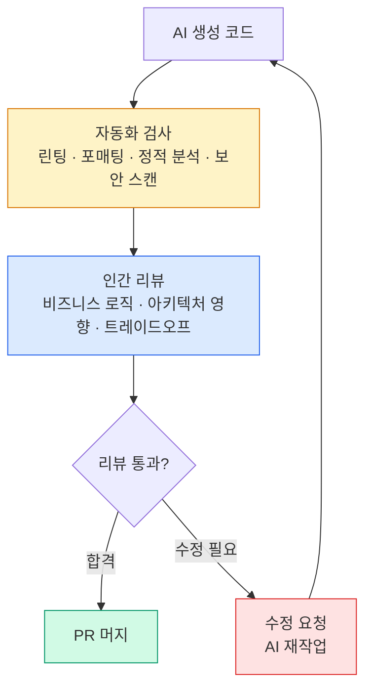

# AI 생성 코드 리뷰 전략

## 왜 리뷰가 더 중요해졌는가

AI가 코드를 더 빠르게, 더 많이 만들수록 **리뷰의 중요성은 비례해서 커집니다.**

```
코드 생성 속도 ↑  →  리뷰해야 할 코드량 ↑  →  리뷰 체계 강화 필요
```

하지만 현실은 반대로 흘러가는 경향이 있습니다. AI가 "잘 짠 것처럼 보이는" 코드를 빠르게 내놓으면, 리뷰자는 경계를 낮춥니다. 이것이 Thoughtworks가 경고하는 **complacency** 현상입니다.

## AI 코드 리뷰의 특수성

AI 생성 코드에는 사람이 잘 안 하는 실수와 **다른 유형의 실수**가 있습니다.

| 사람의 일반적 실수 | AI의 일반적 실수 |
|------------------|-----------------|
| 오타, 문법 오류 | 그럴듯하지만 의미상 틀린 로직 |
| 알고리즘 비효율 | 컨텍스트 없는 패턴 복사 |
| TODO 방치 | 테스트 커버리지 없는 엣지케이스 |
| 문서 부족 | 프로젝트 관례 무시 |



## 리뷰 체크리스트

### 기능 정확성
- [ ] 요구사항을 정확히 구현했는가?
- [ ] 엣지 케이스가 처리되었는가?
- [ ] 오류 처리가 적절한가?

### 보안
- [ ] SQL Injection, XSS, CSRF 등 OWASP Top 10 확인
- [ ] 인증/인가 처리가 올바른가?
- [ ] 민감 데이터(비밀번호, 토큰)가 하드코딩되지 않았는가?
- [ ] 프롬프트 인젝션 가능성이 있는가? (AI 관련 코드)

### 아키텍처
- [ ] 서비스 경계를 침범하지 않는가?
- [ ] 기존 추상화/패턴을 활용하는가?
- [ ] 데이터 일관성 처리가 올바른가?

### 유지보수성
- [ ] 변수/함수명이 의도를 드러내는가?
- [ ] 중복이 없는가?
- [ ] 복잡한 로직에 설명이 있는가?

## 리뷰 피로 방지

### 작은 PR 단위 유지

AI에게 큰 기능을 한 번에 요청하지 말고, **리뷰 가능한 크기로 분해**합니다.

- 목표: PR 당 변경 파일 5개 이하
- 목표: PR 당 변경 라인 200줄 이하

### 자동화로 기계적 검사 제거

사람의 리뷰 에너지는 **판단이 필요한 부분**에 집중합니다.

```
자동화:  린팅, 포매팅, 정적 분석, 보안 스캔
사람:    비즈니스 로직, 아키텍처 영향, 트레이드오프
```

### 리뷰 문화 강화

- 리뷰를 "승인/거부"가 아닌 "배움의 기회"로 프레이밍
- 리뷰 코멘트에 이유 설명 (AI 생성 코드라도)
- 칭찬 코멘트도 활성화 (좋은 AI 활용 사례 공유)
