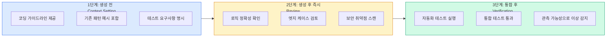

# AI의 불확실성 제어: 결정론적 품질 보증

## 문제: AI는 확률적이다

AI는 확률적으로 답을 내놓기 때문에 결과가 항상 일정하지 않습니다(Hallucination). 이를 소프트웨어 제품으로 출시하려면 **엄격한 품질 관리**가 필요합니다.

AI 생성 코드의 특성:
- 그럴듯하게 보이지만 버그가 숨어있을 수 있음
- 보안 취약점을 포함할 수 있음
- 테스트 없이는 동작 보장 불가
- 프로젝트 관례를 모르는 코드 생성 가능

## Complacency 경고

Thoughtworks는 AI 생성 코드에 대한 **complacency(경계 해제)** 현상을 경고합니다.

> AI가 만든 결과가 그럴듯해 보일수록 사람은 비판적으로 읽지 않게 됩니다. 특히 큰 변경셋일수록 리뷰 피로가 커집니다.

**더 빠른 생성은 더 적은 공학을 의미하지 않습니다.** 오히려 TDD, 정적 분석, 코드 리뷰, 작은 변경 단위, 명확한 테스트 전략 같은 고전적 엔지니어링 실천이 더 중요해집니다.

## 품질 보증의 3단계

### 1단계: 생성 전 (Context Setting)
AI에게 좋은 컨텍스트를 제공해 품질 높은 코드가 나오게 합니다.
- 코딩 가이드라인 제공
- 기존 패턴 예시 포함
- 테스트 요구사항 명시

### 2단계: 생성 후 즉시 (Review)
AI 생성 코드를 비판적으로 검토합니다.
- 로직 정확성 확인
- 엣지 케이스 검토
- 보안 취약점 스캔

### 3단계: 통합 후 (Verification)
시스템에 통합된 후 자동 검증합니다.
- 자동화 테스트 실행
- 통합 테스트 통과 확인
- 관측 가능성으로 이상 감지
