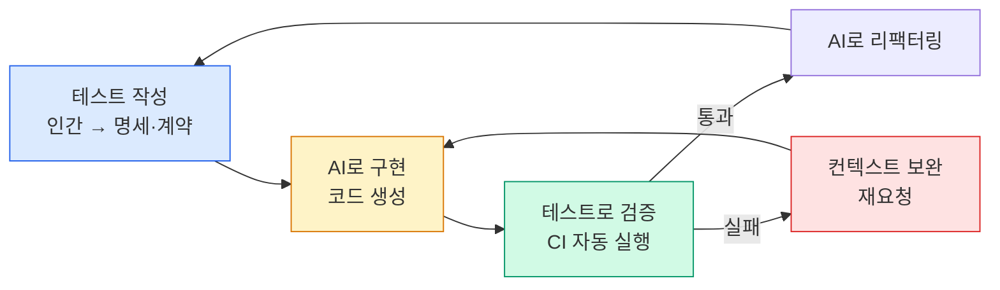

# TDD, 정적 분석, 테스트 전략

## TDD와 AI의 시너지

Test-Driven Development(TDD)는 AI 시대에 새로운 의미를 가집니다.

**전통적 TDD 흐름:**
```
실패 테스트 작성 → 구현 → 테스트 통과 → 리팩터링
```

**AI 시대의 TDD:**
```
명확한 테스트 작성 (인간) → AI로 구현 → 테스트로 AI 결과 검증 → AI로 리팩터링
```

테스트가 먼저 있으면, AI가 생성한 코드의 **정확성을 즉시 검증**할 수 있습니다. 테스트는 AI에게 주는 명세(specification)이자 결과를 검증하는 계약(contract)입니다.



## 테스트 계층

### 단위 테스트 (Unit Test)
- AI 생성 함수/클래스의 기본 동작 검증
- 빠른 피드백 루프
- AI 코드 리팩터링 안전망

### 통합 테스트 (Integration Test)
- AI 생성 컴포넌트들이 서로 올바르게 연동되는지 확인
- 로컬 최적화 코드의 시스템 수준 검증
- 특히 중요: AI는 통합 시나리오를 놓치는 경향

### 엔드투엔드 테스트 (E2E Test)
- 전체 사용자 시나리오 검증
- AI 코드 변경이 기존 기능을 깨지 않는지 확인

## 정적 분석 도구

자동화된 정적 분석은 AI 생성 코드의 기계적 검사를 담당합니다.

| 도구 유형 | 목적 | 예시 도구 |
|---------|------|---------|
| 린터 | 코딩 스타일 준수 | ESLint, Pylint, golangci-lint |
| 타입 체커 | 타입 안전성 | TypeScript, mypy, pyright |
| 보안 스캐너 | 취약점 탐지 | Semgrep, Bandit, CodeQL |
| 복잡도 분석 | 유지보수성 측정 | SonarQube, CodeClimate |
| 의존성 분석 | 취약 라이브러리 탐지 | Snyk, Dependabot |

## CI 파이프라인 통합

AI 생성 코드가 많아질수록 CI 파이프라인이 **품질 게이트**로서 더 중요해집니다.

```yaml
# 예시: AI 시대의 CI 체크리스트
ci-quality-gates:
  - lint: 코딩 스타일 준수
  - type-check: 타입 오류 없음
  - unit-tests: 모든 단위 테스트 통과
  - security-scan: CRITICAL 취약점 없음
  - coverage: 커버리지 80% 이상 유지
  - integration-tests: 통합 테스트 통과
```

## AI와 테스트 자동화의 결합

아이러니하게도, AI는 테스트 작성도 도울 수 있습니다.

- 경계값 분석 테스트 케이스 생성
- 엣지 케이스 목록 제안
- 테스트 픽스처(fixture) 생성
- 목(mock) 객체 생성

**중요**: AI가 생성한 테스트도 리뷰가 필요합니다. AI는 "통과할 테스트"를 만드는 경향이 있어서, 실제로 의미 있는 검증을 하는지 확인해야 합니다.
