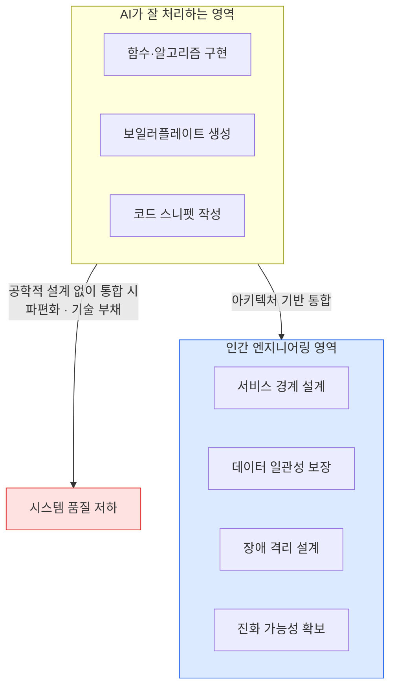

# 코드 생성에서 시스템 설계로

## 무게중심의 이동

AI(LLM)는 이제 수준급의 코드 스니펫을 순식간에 만들어냅니다. 하지만 개별 함수가 잘 작동하는 것과 수만 줄의 코드가 유기적으로 돌아가는 **시스템**을 구축하는 것은 별개의 문제입니다.

**개별 코드 품질** ≠ **시스템 품질**

## 아키텍처의 중요성

AI가 파편화된 코드를 짤수록, 이를 통합하고 유지보수 가능한 구조로 설계하는 **인간의 엔지니어링 역량**이 더 중요해졌습니다.

주요 아키텍처 고려사항:

- **서비스 경계**: 어디서 하나의 서비스가 끝나고 다른 서비스가 시작되는가
- **데이터 일관성**: 분산 환경에서 데이터 정합성을 어떻게 보장하는가
- **장애 격리**: 한 컴포넌트의 장애가 전체 시스템으로 전파되지 않게 하는가
- **진화 가능성**: 요구사항 변화에 얼마나 쉽게 적응할 수 있는가

## 추상화 능력

무엇을 만들지 정의하고, 복잡한 비즈니스 로직을 설계하는 **상위 수준의 공학적 사고**가 개발의 핵심이 되었습니다.

AI는 구현 세부사항을 잘 처리하지만, 다음은 여전히 인간의 영역입니다.

- 도메인 모델 설계
- 인터페이스 계약 정의
- 시스템 품질 속성 우선순위 결정
- 기술 스택 선택과 트레이드오프 판단
