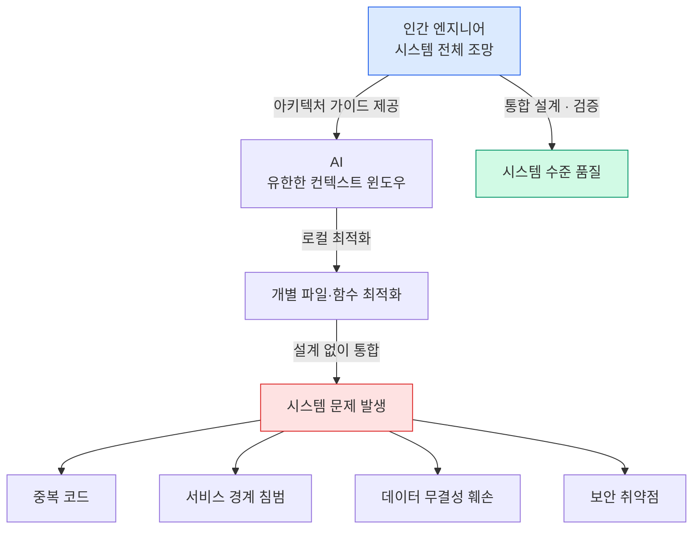

# AI는 로컬 최적화를 잘하지만, 시스템 최적화는 못할 수 있다

## 핵심 문제

AI는 현재 보이는 파일과 맥락 안에서 매우 그럴듯한 해법을 냅니다.

하지만 소프트웨어 시스템은 파일 몇 개의 합이 아닙니다.

> 시스템 = 도메인 모델 + 인터페이스 계약 + 런타임 시나리오 + 배포 구조 + 운영 현실

## 로컬 최적화의 함정

AI가 만든 코드가 **개별적으로는 맞아 보여도**, 전체 시스템 관점에서는 다음 문제를 만들 수 있습니다.

| 문제 유형 | 구체적 사례 |
|----------|------------|
| **중복** | 비슷한 유틸리티 함수가 여러 모듈에 생성됨 |
| **경계 침범** | A 서비스가 B 서비스의 내부 DB를 직접 접근 |
| **결합도 증가** | 단순 기능 추가가 의존성 체인을 타고 전파 |
| **데이터 무결성 훼손** | 분산 트랜잭션 처리가 누락된 코드 생성 |
| **보안 취약점** | 인증 로직이 일부 엔드포인트에서 누락 |

## 왜 이런 일이 생기는가

AI 모델의 컨텍스트 윈도우는 유한합니다. AI는 **지금 보이는 것**을 기반으로 최선의 답을 냅니다. 하지만 시스템 전체의 제약사항, 팀 협약, 과거 결정들은 컨텍스트에 없을 수 있습니다.



## 시스템 관점을 유지하는 방법

### 1. 아키텍처 가이드를 AI 컨텍스트로 제공

```
CLAUDE.md / AGENTS.md 에 포함할 내용:
- 서비스 경계 규칙
- 데이터 접근 패턴
- 금지된 의존성
- 인증/권한 처리 규칙
```

### 2. 작은 변경 단위 유지

AI에게 한 번에 큰 기능을 맡기지 말고, 시스템 경계를 존중하는 작은 단위로 분해해서 요청합니다.

### 3. 아키텍처 리뷰 체크리스트

AI 생성 코드 리뷰 시 다음을 확인합니다.

- [ ] 서비스 경계를 침범하지 않는가?
- [ ] 기존 추상화 레이어를 활용하는가?
- [ ] 데이터 일관성 처리가 올바른가?
- [ ] 보안 처리가 누락되지 않았는가?
- [ ] 기존 패턴과 일관성이 있는가?

### 4. 통합 테스트 강화

AI가 로컬 최적화한 코드들이 **시스템 수준에서 올바르게 동작**하는지 통합 테스트로 검증합니다.

## 결론

설계하고, 분리하고, 경계를 관리하는 기술로서의 소프트웨어 공학이 AI 시대에 다시 중요해지는 이유가 바로 이것입니다. AI는 부품을 잘 만들지만, 그 부품들이 맞물리는 설계도는 인간 엔지니어가 그려야 합니다.
